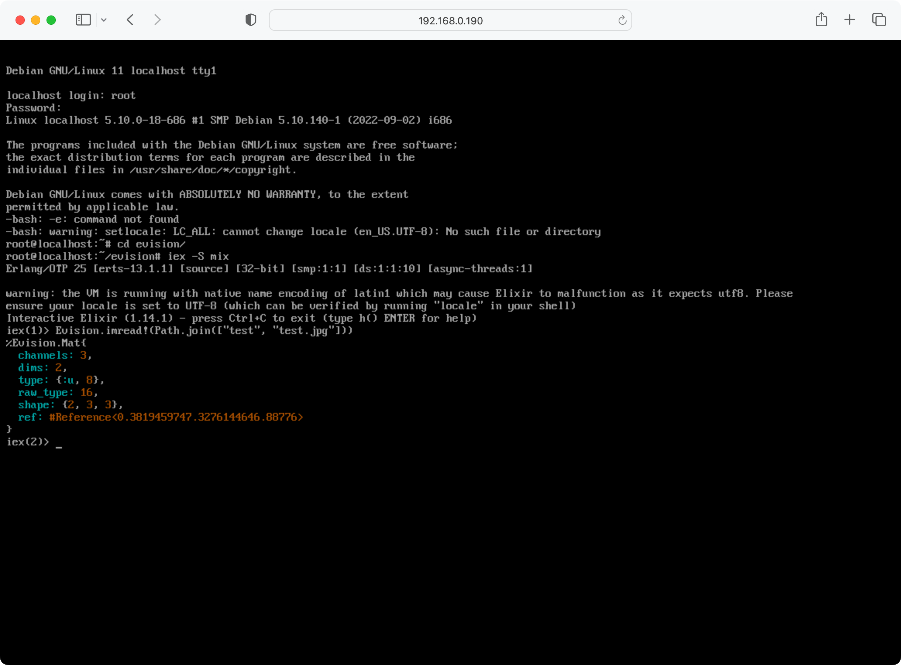

# IEx in Browser

Project to have an IEx in your browser

Heavily inspired (aka copied a lot of the ideas from):
- [https://github.com/snaplet/postgres-wasm](https://github.com/snaplet/postgres-wasm)
- [https://github.com/iximiuz/docker-to-linux](https://github.com/iximiuz/docker-to-linux)
- [https://github.com/copy/v86](https://github.com/copy/v86)

All credit to these projects.

**NOTE** This is extremely janky, not to be taken seriously

## How to setup
1. `cd packages/docker-to-linux`
2. `wget https://github.com/cocoa-xu/iex_wasm_evision/releases/download/prebuilt/erlang-25.1.1.tar.gz -O erlang-25.1.1.tar.gz`
3. `wget https://github.com/cocoa-xu/iex_wasm_evision/releases/download/prebuilt/evision.tar.gz -O evision.tar.gz`
4. `wget https://github.com/cocoa-xu/iex_wasm_evision/releases/download/prebuilt/mix.tar.gz -O mix.tar.gz`
5. `wget https://github.com/cocoa-xu/iex_wasm_evision/releases/download/prebuilt/hex.tar.gz -O hex.tar.gz`
6. `make debian`
7. `mkdir -p ../server/priv/static/rom_images/`
8. `mv debian.img ../server/priv/static/rom_images/`
9.  `docker system prune`
10. `cd ../server`
11. `mix phx.server`

Now go to `http://localhost:4000/` and wait for the magic to happen

User and password are `root:root`

